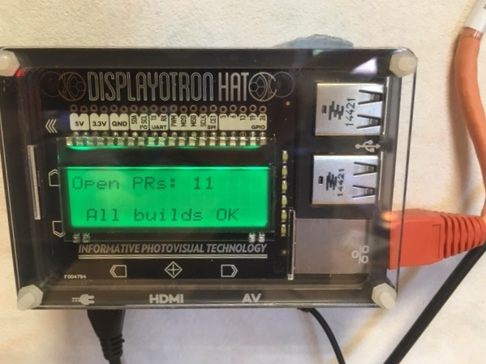

# vstsmonitor
Python [Raspberry Pi](https://www.raspberrypi.org/products/raspberry-pi-3-model-b/) App that tracks builds, pull-requests and other items using the [VSTS REST API](https://docs.microsoft.com/en-us/rest/api/vsts/build/) with [Display-o-Tron HAT](https://shop.pimoroni.com/products/display-o-tron-hat)

Runs on Raspbian Jessie

